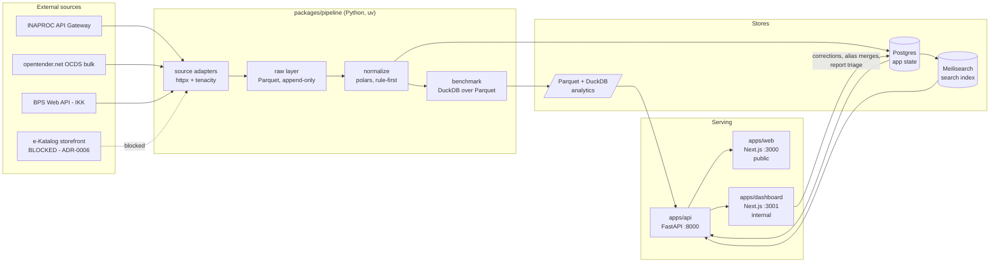

# Architecture

Intended shape. The pipeline, API skeleton, migrations and CI **do** exist and pass; the flag layer, real data
sources and product UI do not. [`status.md`](status.md) is authoritative for the boundary — check it before
assuming anything on this page is live.

This document explains the shape and the reasoning. It does not restate commands (those live in
`package.json` / `turbo.json`), env vars (`.env.example`), or the database schema (the migration files).

---

## Data flow



The loop back from `apps/dashboard` into Postgres is the part that matters. It is the DoZorro model:
machine triage feeds a human review surface, and human decisions are written back so the same judgement is
never made twice. A system with no return arrow is a dashboard, not a project — see
[`methodology/README.md`](methodology/README.md).

---

## Workspaces

| Workspace | Runtime | Port | Role |
|---|---|---|---|
| `apps/web` | Next.js 16 / React 19 | 3000 | **Public site.** National overview, agency profile, vendor profile, package detail. Every string Indonesian and bound by [`editorial-policy.md`](editorial-policy.md). |
| `apps/dashboard` | Next.js 16 / React 19 | 3001 | **Internal admin.** Normalisation correction queue, vendor alias merges, report triage. Not public — but assume screenshots leak. |
| `apps/api` | Python 3.12 / FastAPI | 8000 | Read API for both frontends; write endpoints for dashboard actions and public reports. |
| `packages/pipeline` | Python 3.12 | — | Ingest, normalise, benchmark. Batch, not a service. |
| `packages/ui` | React | — | Components shared by both Next apps. |
| `packages/eslint-config`, `packages/typescript-config` | — | — | Shared configuration. |

Two package managers by design: **bun** for the TypeScript workspaces, **uv** for the two Python ones, each
with its own committed lockfile. Rationale in
[ADR-0001](adr/0001-monorepo-bun-turbo-uv.md). `apps/api` carries a thin `package.json` purely so turbo can
run its tasks; `packages/pipeline` currently lacks one, which is why turbo cannot see it
([`status.md`](status.md)).

---

## Storage: three roles, three engines

Rationale in [ADR-0005](adr/0005-storage-duckdb-postgres-meili.md).

| Engine | Role | Why not one of the others |
|---|---|---|
| **Parquet + DuckDB** | Analytical. Raw ingested data and benchmark computation over millions of rows. | Column-oriented aggregation over the whole corpus is what DuckDB is for. Doing it in Postgres means loading everything first. |
| **Postgres** | Application state. Resolved entities, aliases, normalisation decisions, users, reports, flags. | Needs transactions, constraints, concurrent writes from the dashboard — none of which DuckDB provides. |
| **Meilisearch** | Search. Typo-tolerant lookup across agency, vendor, and package names. | Indonesian procurement names are inconsistently spelled; users will not type them exactly. Postgres full-text does not tolerate that well. |

The split follows the read pattern: batch analytics write Parquet; the app reads Postgres; users search
Meilisearch. Conflating them would mean either an analytics engine handling transactions or a transactional
database doing full-corpus aggregation, and both degrade badly at this data volume.

---

## Pipeline design

Four stages, each independently runnable and re-runnable. All four are implemented — on fixtures and manually
downloaded CSV, not on a real source.

```
sources (adapter)  →  data/raw/<source>/<year>/*.parquet        as received, never edited
                   →  normalize (polars)                        src/pipeline/normalize.py
                   →  data/normalized/<source>/<year>/          comparable items
                   →  benchmark (DuckDB)                        sql/benchmark.sql
                   →  data/benchmarks/<source>-<year>.parquet   n / p25 / median / p75 / MAD
```

Data root is `PELINTIR_DATA_DIR` (default `packages/pipeline/data`), resolved in
`src/pipeline/settings.py`. Everything under it is gitignored.

**1. Source adapters.** A `Source` protocol with `fetch(fiscal_year, category) -> Iterator[dict]`, one
implementation per source, plus a 13-column typed `RAW_SCHEMA` and `to_frame()` so every adapter lands the
same shape. Extra columns from a source are preserved, not dropped. `httpx` for transport, `tenacity` for
retry with backoff, honouring 429. One adapter exists: `local_csv`.

The data source is not yet decided, and access to the most valuable one is blocked. The adapter pattern is
the response: downstream code depends on the protocol, not on any particular endpoint, so resolving
[ADR-0006](adr/0006-scrape-ekatalog-storefront.md) in any direction costs one adapter rather than a rewrite.
Rationale: [ADR-0009](adr/0009-generic-source-adapter-pattern.md).

**2. Raw layer.** Fetched records written **exactly as received** to Parquet, partitioned
`data/raw/<source>/<year>/`. Append-only, never edited in place. Local paths first; moving to object storage
later is a prefix change plus `storage_options`, not a structural one.

Append-only matters for a specific reason: source records are amended after publication, and a published
flag is a claim about a specific snapshot. Overwriting raw data destroys the ability to explain why we said
what we said.

**3. Normalisation.** Pure polars expressions over frames — no per-row Python, so the same code runs on ten
rows in a test and millions in the pipeline. Offline: no network in the transform layer, so a run is
reproducible from the raw layer alone. Every rule is a small named function with its own test, which is what
makes it possible to point at the exact rule that put two items in the same bucket. Rows that cannot be used
are not dropped silently — they carry a `reject_reason` and `split_usable()` separates them.

Currently groups by `canonical_category`, **not KBKI** — [ADR-0011](adr/0011-category-vocabulary-before-kbki.md).
Target spec: [`methodology/item-normalization.md`](methodology/item-normalization.md).

**4. Benchmark.** Versioned SQL in `packages/pipeline/sql/`, read straight over Parquet via `read_parquet`.
Emits per-group `n` / `min` / `p25` / `median` / `p75` / `max` / MAD / scaled MAD, and rejects groups below
`$min_group_size` (default 5). MAD rather than standard deviation, because one 100× outlier would inflate a
stddev enough to hide every other outlier behind it. Spec:
[`methodology/peer-group.md`](methodology/peer-group.md).

**No flag is emitted anywhere yet** — the benchmark produces distribution statistics only. When flags land,
their thresholds must come from flag spec frontmatter
([ADR-0007](adr/0007-flag-specs-as-single-source.md)), not from Python constants; a magic number in a pipeline
module is a bug. `DEFAULT_MIN_GROUP_SIZE = 5` in `benchmark.py` is the current exception, and is on the list
in [`status.md`](status.md).

---

## Licence quarantine

A structural consequence of [ADR-0002](adr/0002-data-licence-lineage.md), not merely a policy: sources
under non-commercial licences occupy a separate zone of the raw layer, and nothing from that zone may flow
into a published artifact. Any source's status is recorded in
[`data/legal-register.md`](data/legal-register.md), which functions as a merge gate.

This is why licence is a property tracked per partition rather than per query. Enforcing it at read time
would mean trusting every future query author to remember.

---

## API

FastAPI, with the generated OpenAPI document at `/docs` as the authoritative description of the surface.
There is no hand-written API reference and there will not be one — it would only drift.

Conventions, established in code: `pydantic-settings` for configuration (`app/settings.py`, no
`python-dotenv`), a lifespan-managed `psycopg` connection pool rather than per-request connections, CORS
origins from settings, and `GET /health` reporting Postgres and Meilisearch reachability separately so a
degraded dependency is visible rather than fatal. No logging of request bodies that carry vendor identity.

No domain endpoints exist yet — nothing serves procurement data.

---

## Deployment

One VPS. `docker compose` for Postgres and Meilisearch, both bound to `127.0.0.1`; the apps run through turbo.
Cron for the batch job until there are real inter-job dependencies. Raw storage moves to Cloudflare R2 rather
than S3 when it leaves local disk — zero egress matters for a project whose purpose is distributing bulk data.
Rationale and rejected alternatives: [ADR-0010](adr/0010-single-vps-cron-r2.md).

---

## What does not exist yet

The flag layer (no indicator is computed anywhere), any real data source, the licence quarantine required by
[ADR-0002](adr/0002-data-licence-lineage.md), the Meilisearch index and its sync path, the dashboard review
queue, and both product frontends beyond starter pages.

The per-item gap list is maintained in [`status.md`](status.md) so there is one place to check.

---

## Related

- [`status.md`](status.md) — what actually runs today
- [`methodology/README.md`](methodology/README.md) — the triage doctrine this architecture serves
- [`data/sources.md`](data/sources.md) — what the adapters would fetch
- [`adr/`](adr/) — why each of these choices was made
